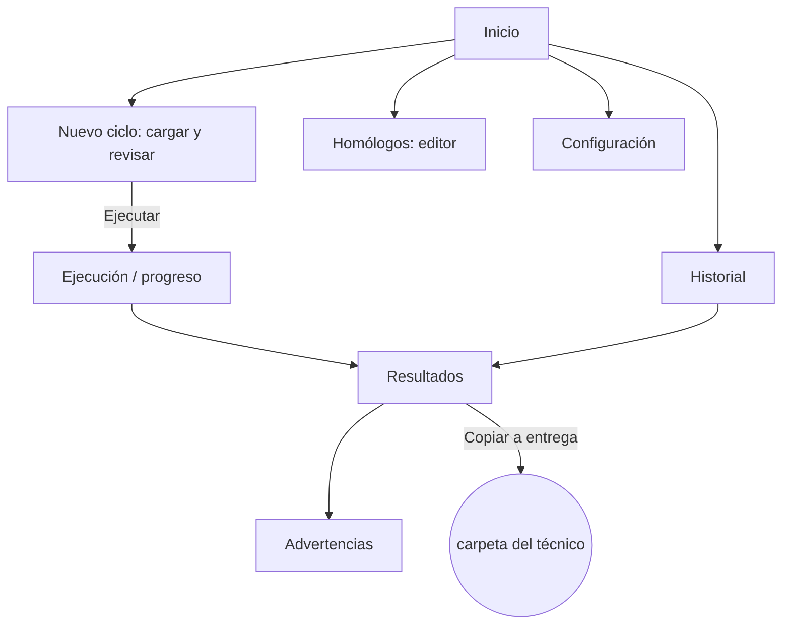

# TINT_SIS — crear las vistas en Figma (paso a paso)

Contexto para retomar este trabajo desde otra herramienta (Claude Code u otra). Basado en `VISTAS_TINT_SIS.md` (spec de las 8 pantallas) y en el canvas HTML de referencia ya armado.

## Estado actual

- Ya existe un archivo de Figma creado: **"TINT_SIS — UI"**
  - File key: `AiqcNYuB3oRVGXnezoUcLY`
  - URL: https://www.figma.com/design/AiqcNYuB3oRVGXnezoUcLY
  - Plan: `team::1651032969137523534` (seat **View**, tier **starter**)
- La página inicial ya fue renombrada a "TINT_SIS — UI".
- **Nada más se creó todavía** — componentes, variables y las 8 pantallas siguen pendientes.
- Importante: el seat del plan es **View**, que en el editor humano de Figma es de solo lectura. Si al escribir vía API/plugin da error de permisos, ese es el primer sospechoso — puede requerir un seat Dev o Full para escribir en archivos de producción.

## Restricción del plan gratuito

El plan Starter limita a **3 páginas por archivo**. Por eso la estructura usa **una sola página** con **Sections** (no páginas) para separar Cover / Design system / Screens / Flow — las secciones no cuentan para ese límite.

## Estructura del archivo

1 página → 4 secciones, una al lado de la otra en el canvas:

```
Cover · Design system · Screens · Flow
```

## Sistema de diseño — tokens

**Color** (crear como variables, no estilos sueltos):

| Token | Hex | Uso |
|---|---|---|
| `ink` | `#1B1F24` | texto principal |
| `ink-muted` | `#5B6570` | texto secundario |
| `linea` | `#E2E4E3` | bordes / divisores |
| `accent` | `#1B6E76` | acción primaria, nav activo |
| `ok` | `#1E7D34` | tag OK (fondo al 10%) |
| `advertencia` | `#B45A00` | tag Advertencia (fondo al 10%) |
| `error` | `#C42B2B` | tag Error/bloqueante (fondo al 10%) |
| `no-habilitado` | `#6B7280` | tag Grupo no habilitado (fondo al 10%) |

**Tipografía:** dos estilos de texto —
- `UI/Body`: fuente sans normal (Inter u otra), para labels, botones, texto de interfaz.
- `Mono/Data`: fuente monoespaciada (JetBrains Mono, Roboto Mono), reservada para nombres de archivo, `ID_TINT`, fechas, porcentajes — todo lo que sea un valor literal del sistema, no texto redactado.

## Componentes a construir (en "Design system")

Construir en este orden, cada uno como componente con variantes vía `Combine as variants`:

1. **Tag de estado** — 4 variantes: OK (verde) · Advertencia (ámbar) · Error/bloqueante (rojo) · Grupo no habilitado (gris). Rectángulo con esquinas de 3px.
2. **Botón** — variantes primario/secundario.
3. **Barra de progreso** — track + fill, con % editable.
4. **Card numérica** — valor grande (mono) + etiqueta chica (UI).
5. **Fila de tabla genérica** — auto layout horizontal, columnas de texto configurables. Se reusa en dos tablas: `Archivo · Software/destino · Flujo · Estado` (Nuevo ciclo) y `Salida · Tipo · Filas · Acciones` (Resultados).
6. **Shell / Base** — nav lateral (220px, fondo oscuro, 6 ítems: Inicio · Nuevo ciclo · Resultados · Historial · Homólogos · Configuración, cada ítem con variante activo/inactivo) + franja de estado superior (1440×40: carpeta activa, fecha del último ciclo, software). Frame completo de 1440×900 con el área de contenido vacía.

## Las 8 pantallas (sección "Screens")

Todas a **1440×900**, con una instancia del Shell adentro. Contenido de cada una (resumen — el detalle completo está en `VISTAS_TINT_SIS.md`):

1. **Inicio / Panel** *(v1)* — card "Último ciclo" (fecha, experto usado, 2 cards numéricas: archivos generados / advertencias), botón primario "Nuevo ciclo", accesos rápidos, banner de alerta si falta configuración.
2. **Nuevo ciclo — cargar y revisar** *(v1)* — dropzone, tabla "Archivos detectados" (Archivo/Software/Flujo/Estado), chips de tiendas habilitadas, botón Ejecutar + opción "ejecutar igual, omitiendo fallos".
3. **Ejecución / Progreso** *(v1)* — progreso global + tiempo transcurrido, progreso por tienda (MP14, MP12, Tiendas 14, Tiendas 12), log en vivo colapsable, botón Cancelar.
4. **Resultados** *(v1)* — resumen numérico, tabla agrupada por software → tienda (Salida/Tipo/Filas/Acciones: Abrir, Abrir carpeta, Previsualizar, Copiar a entrega), acceso a Advertencias.
5. **Advertencias** *(v1, puede vivir dentro de Resultados)* — filtros por tipo/archivo, contador, tabla de advertencias de ingesta, exportar a texto.
6. **Historial** *(v2)* — tabla de corridas (fecha, carpeta origen, experto, nº archivos, nº advertencias), detalle de una corrida, nota de "diff futuro" entre ciclos.
7. **Configuración** *(v1 mínimo / v2 completo)* — v1: carpeta de trabajo (entrada/salida/db) + checklist de tiendas habilitadas. v2: tabla de softwares/máquinas (nombre, formato, habilitado, carpeta de entrega) + nombres esperados de archivos.
8. **Homólogos (editor)** *(v2)* — selector de tienda, árbol Línea → Homólogo → lista de `ID_TINT` (usar `<details>`/estructura colapsable), panel de cobertura (IDs sin asignar, homólogos sin ID), guardar en `homologos_TINT.xlsx`.

## Flujo de navegación (sección "Flow", prototype)



Además, los 6 ítems del nav lateral deben conectarse entre sí en las 8 pantallas (para poder navegar el sistema completo en modo Present, no solo seguir el flujo feliz).

## Paso a paso

1. **Archivo y secciones** — usar el archivo ya creado (arriba) o crear uno nuevo. Una sola página, 4 secciones (`S`, Section tool): Cover, Design system, Screens, Flow.
2. **Colores y tipografía** — cargar la tabla de tokens como variables (Local variables) dentro de "Design system". Crear los 2 text styles (`UI/Body`, `Mono/Data`).
3. **Componentes chicos** — Tag de estado → Botón → Barra de progreso → Card numérica, cada uno: dibujar → convertir en componente → duplicar variantes → `Combine as variants`.
4. **Tabla genérica y Shell** — fila de tabla con auto layout; Shell con nav (220×900) + franja de estado (1440×40) combinados en un frame 1440×900, convertido en componente "Shell / Base".
5. **8 frames en "Screens"** — 1440×900 cada uno, instancia del Shell adentro, nombrados `01 Inicio` a `08 Homólogos`.
6. **Contenido de cada pantalla** — instanciar Tag/Botón/Tabla/Card según el resumen de arriba, editar textos.
7. **Prototype** — conectar el flujo (diagrama de arriba) + los 6 ítems del nav entre sí en cada pantalla. Opcional: duplicar las 8 pantallas a la sección "Flow" para prototipar sobre una copia limpia.

## Fuera de alcance v1

No construir todavía: multiusuario/permisos/nube, edición de fórmulas del experto (solo lectura), detección automática de cambios entre ciclos (queda para v2, en Historial).
