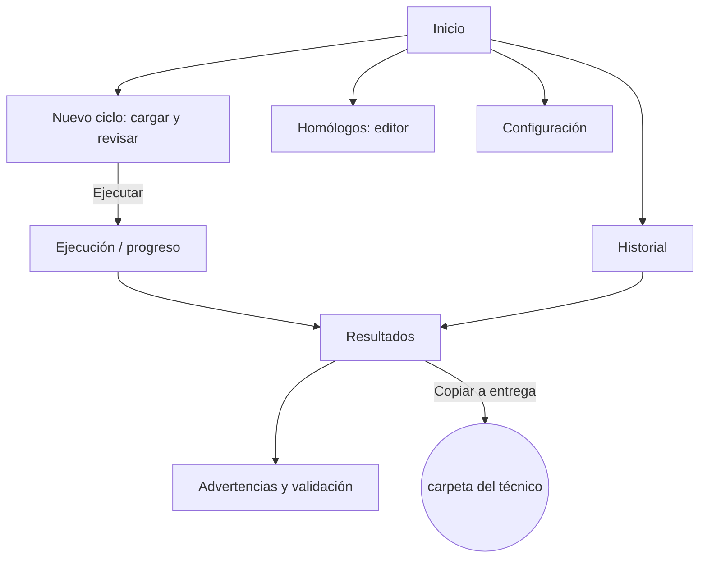

# Vistas mínimas de TINT_SIS (para diseñar en Figma)

Este documento lista las pantallas mínimas que necesita la app de escritorio de
TINT_SIS. Todavía no están diseñadas: sirve como checklist para crear los frames
en Figma y como referencia para implementarlas después.

## Contexto

- **App de escritorio**, ejecutable Windows (una carpeta con `.exe`, sin instalar
  Python). **1 usuario, 1 PC, offline.**
- **Usuario:** Departamento de Desarrollo e Investigación. Recibe los archivos
  expertos de tintometría cada ~15 días y los transforma a la GData del formato
  de cada software de máquina, para entregar a los técnicos.
- El **motor de transformación ya existe y funciona por CLI**. Estas vistas
  reemplazan el uso de terminal, no cambian la lógica.
- **Multi-software:** hoy TINT_SIS cubre **CorobLab** (`.txt`) y **xData** (CSV
  filtrado por tienda). Próximo: **SANTINT**; luego Fluid / Tintwise_Lab / Ibicus.
  Las vistas deben ser **agnósticas del software**: sumar uno = sumar un adaptador
  y una fila de configuración, **no una pantalla nueva**.

## Shell / navegación

- Ventana única. Navegación lateral (o superior) con:
  **Inicio · Nuevo ciclo · Resultados · Historial · Homólogos · Configuración**.
- Franja de estado persistente (arriba o abajo): carpeta de trabajo activa,
  fecha del último ciclo, software(s) cubiertos.

## Flujo entre vistas

---

## 1. Inicio / Panel — *v1*

**Objetivo:** estado de un vistazo y entrar a un ciclo nuevo.

**Contenido:**
- Tarjeta "Último ciclo": fecha, archivo experto usado, nº fórmulas leídas /
  generadas / con error, nº archivos generados, nº advertencias.
- Botón primario **Nuevo ciclo**.
- Accesos rápidos: Resultados del último ciclo, Historial, Configuración.
- Alertas si falta algo (no hay carpeta de trabajo configurada, no está
  `homologos_TINT.xlsx`, no hay experto en la carpeta de entrada).

**Estados:** sin ningún ciclo aún (onboarding: "elegí la carpeta de trabajo") ·
ciclo OK · ciclo con errores.

**Datos:** último `batch` de `tint_sis.db` + `PipelineSummary`.

---

## 2. Nuevo ciclo — Cargar y revisar — *v1*

**Objetivo:** ver qué se va a procesar y detectar problemas **antes** de correr
(el filtro es lento, ~10 min).

**Contenido:**
- Zona para soltar / elegir archivos → se copian a la carpeta de entrada.
- Tabla **"Archivos detectados"**:

  | Archivo | Software / destino | Flujo | Estado |
  |---|---|---|---|

  - **Flujo:** FORMULARIO clásico · Passthrough CSV · Filtro por homólogos (xData).
  - **Estado:** OK · Falta metadata (`.json`) · Máquina no registrada ·
    Grupo/tienda no habilitada · Nombre no reconocido.
- Para el flujo homólogos: muestra el `homologos_TINT.xlsx` activo y qué tiendas
  están habilitadas.
- Botón **Ejecutar** (deshabilitado si hay bloqueantes; opción "ejecutar igual,
  omitiendo los que fallan").

**Estados:** carpeta vacía · todo OK · con advertencias no bloqueantes · con
bloqueantes.

**Datos:** función *previsualizar ciclo* (dry-run) sobre la carpeta de entrada.

---

## 3. Ejecución / Progreso — *v1*

**Objetivo:** que el usuario vea que el sistema está trabajando (el filtro tarda
~10 min con las 4 tiendas).

**Contenido:**
- Lista de pasos con progreso: por línea de producto (CorobLab) y por tienda
  (xData: MP14, MP12, Tiendas 14, Tiendas 12).
- Barra global + tiempo transcurrido.
- Log en vivo (colapsable).
- Botón **Cancelar**.

**Estados:** en curso · terminado OK (→ Resultados) · terminado con errores.

**Datos:** eventos de progreso emitidos por el motor.

---

## 4. Resultados — *v1*

**Objetivo:** revisar y entregar lo generado.

**Contenido:**
- Agrupado por **software → línea/tienda**:

  | Salida | Tipo | Filas | Acciones |
  |---|---|---|---|

  - **Tipos:** `.txt` CorobLab · `.csv` · `.xlsx` · `_ready` filtrado.
  - **Acciones:** Abrir · Abrir carpeta · Previsualizar (primeras N filas en
    tabla) · Copiar a carpeta de entrega (si está configurada).
- Resumen numérico arriba (igual que Inicio).
- Acceso a "Advertencias y validación".

**Estados:** sin resultados · con resultados · con archivos que no se generaron
por error.

**Datos:** `summary.archivos_*` + preview de primeras filas de cada archivo.

---

## 5. Advertencias y validación — *v1* (puede ser una sección dentro de Resultados)

**Objetivo:** entender qué quedó afuera y por qué.

**Contenido:**
- **Advertencias de ingesta:** archivos salteados enteros (falta metadata,
  máquina no registrada, tienda no habilitada).
- **Hallazgos de validación:** filas puntuales excluidas (rango R/G/B fuera de
  límite, campo obligatorio vacío, etc.) — *archivo · fila · mensaje*.
- Filtro por tipo / archivo. Contador. Exportar a texto.

**Estados:** sin hallazgos (verde) · con advertencias · con errores.

**Datos:** `summary.ingestion_warnings` + `summary.issues`.

---

## 6. Historial — *v2*

**Objetivo:** auditoría y re-descarga.

**Contenido:**
- Tabla de corridas: fecha/hora, carpeta origen, archivo experto, nº archivos
  generados, nº advertencias.
- Detalle de una corrida: mismos datos que Resultados de ese ciclo; re-abrir /
  re-copiar archivos.
- *(Futuro)* diff contra el ciclo anterior: colores nuevos / modificados /
  eliminados por línea.

**Datos:** tablas `batches` + `generated_files` de `tint_sis.db`.

---

## 7. Configuración — *v1 mínimo, v2 completo*

**v1 (mínimo):**
- Carpeta de trabajo (entrada / salida / db).
- Tiendas habilitadas: checklist MP14 / MP12 / Tiendas 14 / Tiendas 12.

**v2 (completo):**
- **Softwares / máquinas:** nombre, formato de salida, habilitado, carpeta de
  entrega.
- Tabla **Familia → prefijo numérico** (CorobLab).
- Nombre esperado del homólogos maestro y patrón del nombre del experto.

Todo lo que hoy vive en código (`ENABLED_GRUPOS`, `MACHINE_OUTPUT_FORMATS`).

**Datos:** `config.json`.

---

## 8. Homólogos (editor) — *v2*

**Objetivo:** mantener qué `ID_TINT` lleva cada tienda sin abrir Excel.

**Contenido:**
- Selector de tienda (hoja).
- Árbol **Línea → Homólogo → lista de `ID_TINT`**.
- Acciones: agregar / quitar `ID_TINT` de un homólogo; alta de línea o producto
  nuevo; marcar un homólogo como "pendiente" (placeholder tipo *Chilcomar Top 15
  Ral*, que existe pero todavía no tiene fórmulas).
- Panel de **cobertura**: `ID_TINT` del experto que no están asignados a ninguna
  tienda; homólogos sin ningún ID.
- Guarda en `homologos_TINT.xlsx` respetando la estructura (columna `ID_TINT`,
  filas de estructura intactas).

**Datos:** hojas de `homologos_TINT.xlsx` + set de IDs de la hoja `Formulas` del
experto (para la cobertura).

---

## Fuera de alcance v1

- Multiusuario / permisos / nube.
- Edición de fórmulas del experto (el experto es de solo lectura).
- Detección automática de cambios entre ciclos (va en v2, vista Historial).
